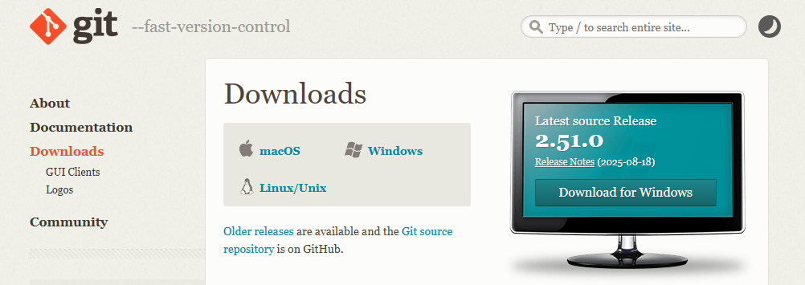
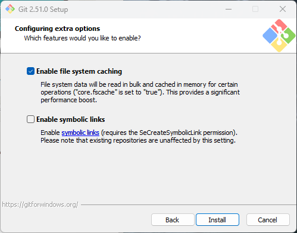
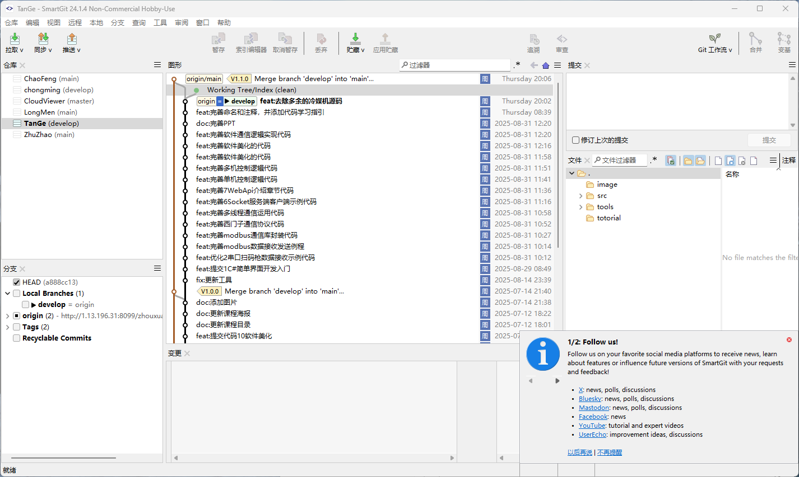
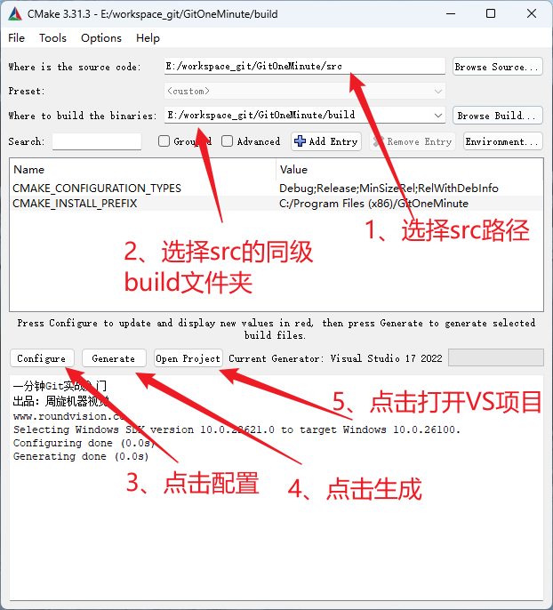

# 1、Git安装

在所有课程开始之前，我们都需要安装Git，你可以将它理解为一个服务，也可以理解为一个软件。它没有用户交互界面，只能通过命令行交互。

git官方下载地址：https://git-scm.com/downloads



我们安装windows的，所以直接点击右侧的"Download for Windows"：


直接下载最新版本。

双击下载的Git-2.51.0-64-bit.exe安装包，选择一个安装目录，直接一路默认选项下一步，


直接install安装：


## 1.1检查git安装成功

- 打开Windows命令行终端：在开始菜单中搜索 `cmd`（命令提示符）或 `PowerShell` 并打开。

- 在命令行中输入以下命令，然后按回车键（Enter）：

  git --version

- 如果安装成功，命令行会显示已安装的 Git 版本号。例如：

  ```
  git version 2.37.1 (Apple Git-222.1)  # 这是在 macOS 上的示例
  # 或者
  git version 2.39.2.windows.1          # 这是在 Windows 上的示例
  ```

  

# 2、smartGit安装

git没有用户交互界面，只能通过命令行交互。

所以所有课程都会先教你怎么用命令行去完成所有的git操作，但这是南辕北辙的，git版本控制学的应该是版本控制的思想和操作，而不是命令行本身。


在Git官网其实推荐了很多第三方git交互软件，这些软件有免费的也有付费的，我们课程是使用一个smartgit的第三方软件，这个软件是面向企业付费的，但我们个人首次使用有90天试用期，而且以后也可以申请个人开发者来永久使用(很简单，大家需要时自行百度)。

smartgit官网：https://www.smartgit.dev/


安装完毕后页面如下：



# 3、配置smartgit

### 


# 4、创建一个项目仓库

为了大家可以实战操作，并给大家演示真实的版本管理，所以我们在github上创建一个项目仓库，用来存储我们《一分钟git》课程的讲义和源码。

进入github并登录，创建一份新项目仓库：https://github.com/。

https://github.com/zhouxuan2023/GitOneMinute

我们项目仓库分五个文件：

- README.md：必读文档
- LICENSE
- tutorial：存放讲义的文件夹
- image：存放图片的文件夹
- src：存放源码的文件夹

我们的src源码只有两个文件，分别是main.cpp和CMakeLists.txt。

我们使用CMake管理源码，使用C++初始化了一个string的列表，并将这个列表依次打印，字符串列表的内容遵循：

“你的名字 hello git! 你学习该项目的时间戳”的格式

我们希望每一个学习这个课程的同学，在课程结束时，都可以在这个代码里留下自己的名字，并通过学到的git操作，将你的修改提交到项目github仓库中。

如果你对C++和CMake不了解，可以看我另一门免费课程：
[《](https://www.bilibili.com/video/BV1YG411e7D5)[图像处理软件开发全面入门教程：](https://www.bilibili.com/video/BV1YG411e7D5)[C++/QT/](https://www.bilibili.com/video/BV1YG411e7D5)[Opencv](https://www.bilibili.com/video/BV1YG411e7D5)[/](https://www.bilibili.com/video/BV1YG411e7D5)[CMake](https://www.bilibili.com/video/BV1YG411e7D5)[/](https://www.bilibili.com/video/BV1YG411e7D5)[软件开发](https://www.bilibili.com/video/BV1YG411e7D5)[/](https://www.bilibili.com/video/BV1YG411e7D5)[设计模式](https://www.bilibili.com/video/BV1YG411e7D5)[/](https://www.bilibili.com/video/BV1YG411e7D5)[动态库](https://www.bilibili.com/video/BV1YG411e7D5)[》](https://www.bilibili.com/video/BV1YG411e7D5)

## 4.1源码编译

编译源码也很简单，打开CMake-GUI工具，编译源码即可生成VS的sln文件：




